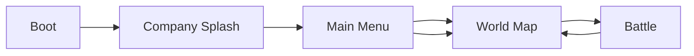

# Gameplay, Mechanics & Asset Requirements

**Last updated:** 2026-06-04  
**Purpose:** Player-facing overview of how the game works today, what is implemented in code, and which art/audio assets are still needed.  
**Design canon:** [README_02](README_02_GAMEPLAY_VISUAL_UX_REPLAYABILITY.md) · [README_01](README_01_PHASE_BASED_ASSET_GENERATION.md)  
**Related:** [GAME_LOGIC_AND_ESSENTIALS.md](GAME_LOGIC_AND_ESSENTIALS.md) · [GAMEPLAY_SPEC.md](GAMEPLAY_SPEC.md) · [IMPLEMENTATION_STATUS.md](IMPLEMENTATION_STATUS.md) · [GODOT_PORT_STATUS.md](GODOT_PORT_STATUS.md) · [ASSET_PIPELINE.md](ASSET_PIPELINE.md) · [VISUAL_AND_VFX_SPEC.md](VISUAL_AND_VFX_SPEC.md)

---

## 1. Front-end flow (how you start playing)

| Step | Scene | What happens |
|------|-------|----------------|
| 1 | **Boot** | Loads save, audio, `SceneFlowController` (loading fade overlay). |
| 2 | **CompanySplash** | Studio title ~2.5s; tap or Skip → async load. |
| 3 | **MainMenu** | **Play Campaign** → World Map. Toolbar opens meta panels (Hero, Towers, Relics, Daily, Bazaar, Quests, Forge, etc.). Premium/Battle Pass UI may be stubbed — not launch catalog ([README_03](README_03_ETHICAL_MONETIZATION_BUSINESS.md)). **Settings** for volume. **Quit**. |
| 4 | **WorldMap** | Seven **Khan** nodes (campaign). **Endless** and **Hunt Zahhak** unlock after finishing all Khans (Hunt also needs First Talisman from Khan 7). Tap node → popup → Start battle. |
| 5 | **Battle** | Tower defense loop. Victory → rewards + return to World Map (or Hunt/Roguelite return scene). |

**Test in Godot:** Open `shahname-td-godot/shahname-td/`, press **F5** (boot) or **F6** (current scene). See [GODOT_PORT_STATUS.md](GODOT_PORT_STATUS.md).

**First art milestone:** README_01 Phase 0 (Rostam, prototype HUD, Khan 1 map) then Phase 1 (four towers, Lion, core VFX).

---

## 2. Campaign — Seven Khans (Haft Khan)

Rostam’s seven labors are the main campaign chain on the world map:

| # | Level ID | Display name (generated) | Boss |
|---|----------|--------------------------|------|
| 1 | `level_01` | Khan 1 — Lion and Rakhsh (32×18) | Lion of the First Khan |
| 2 | `level_02` | Khan 2 — Desert of Thirst | Manifestation of Thirst |
| 3 | `level_03` | Khan 3 — Azhdaha Canyon | Azhdaha |
| 4 | `level_04` | Khan 4 — Sorceress Feast | Sorceress |
| 5 | `level_05` | Khan 5 — Olad Camp | Olad champion |
| 6 | `level_06` | Khan 6 — Arzhang Fortress | Arzhang Div |
| 7 | `level_07` | Khan 7 — White Div Cavern | Div-e Sepid |
| 8 | (finale) | Damavand Binding (64×36) | Zahhak binding (campaign finale) |

**Progression rules**

- Only `level_01` is unlocked at start.
- Winning a level completes it, grants soft currency, and unlocks `nextLevelId`.
- Each Khan first-clear grants one **Khan seal** (7-piece binding mosaic on world map).
- All **7 seals** unlock **Hunt for Zahhak** (`DamavandQuestManager.can_enter_hunt_mode()`); Khan 7 also sets **First Talisman** for legacy saves.
- **Endless** requires `SaveSystem.all_khans_completed()` (all seven Khans cleared).
- **Khan 7** campaign battle may include a one-time Damavand/Zahhak teaser; repeatable bind-to-Damavand is **Hunt only**.

---

## 3. Post-campaign modes

### Endless

- Procedural waves via `EndlessWaveGenerator`; best wave stored in save.
- Launched from World Map quick button or **Endless** meta panel.
- Gated until all 7 Khans are completed.

### Hunt for Zahhak

- Survival mode: milestone waves grant **Star Iron**; 100 iron → 1 **Damavand anchor** (3 per binding; 2 after three lifetime bindings).
- Finale when **7 campaign seals + anchors ready + wave 50**: Forge unlock, Zahhak spawns, drag to **Damavand** with 2 adjacent Forge towers.
- Each Hunt binding victory resets anchors and raises **Zahhak Fury** for the next run.
- Gated until all **7 Khan seals** are collected.

### Roguelite (separate)

- **RogueliteMap** scene: node graph, blessings between fights. Not part of the 7-Khan gate.

---

## 4. Core battle gameplay

### Standard tower defense loop

1. **Waves** spawn enemies along waypoints (`WaveManager`, `EnemySpawner`).
2. **Build spots:** tap empty spot → bottom-center **tower cards** → build for gold.
3. **Occupied spot:** upgrade / sell panel.
4. **Lives** decrease when enemies leak; **0 lives** → defeat (optional **Simorgh Feather** continue once).
5. Clear all waves → **Victory** (results panel: waves, lives, coins, hero XP, veterancy souls).

### Hero (Rostam / Zal)

- **Tap ground** to move.
- **Skill button** (bottom-left cluster with portrait placeholder).
- **Sacred Tether:** drag hero to tower for attack-speed buff; drains energy.
- **Sacred Fire:** spend on **Cleanse** / **Brazier** for selected build spot region.
- **Qanat** (levels with qanat nodes): fast-travel network when hero is near a node.

### Signature systems (identity)

| System | Player-facing effect |
|--------|-------------------|
| **Regional light / corruption** | Corruptors darken regions; towers weaken; at 0 light towers **hijack** and attack allies until hero purges. |
| **Sacred Fire** | Currency from corruptor kills; cleanse regions and light braziers. |
| **Morale** | Slider top-left; high morale boosts towers/hero; low morale penalizes. |
| **Fate weaving** | Pre-battle draft on some levels; double-edged boons/curses in run. |
| **Zervan Dial** | Hold **Rewind** to snapshot-restore enemies and region lights (tower HP/hero energy restore incomplete). |
| **Khan phases** | Bosses trigger phase banners + regional penalties every 15% HP. |
| **Blood Oath** | Milestone waves: accept/decline risky oath for rewards. |
| **Ahriman Director** | Adapts boss resistances to your most-used tower family (needs family tags on tower assets). |
| **Prophecy** | Optional objective text on HUD when active. |

### Battle HUD layout (landscape mobile)

| Zone | Elements |
|------|----------|
| Top left | Lives, gold, wave, Sacred Fire, morale |
| Top right | Pause (with overlay), 1×/2×, settings, cleanse, brazier, qanat, rewind |
| Center banners | Khan phase, director warning, tribute hunger |
| Bottom left | Hero portrait (placeholder) + skill |
| Bottom center | Tower build cards |
| Bottom right | Relics / organ drag / energy (runtime overlay) |
| Full screen | Victory/defeat results, Simorgh continue, blood oath, fate draft |

---

## 5. Meta systems (menus & world map)

Available from **Main Menu** and **World Map** toolbars:

| Feature | Purpose |
|---------|---------|
| Daily Challenge | Date-seeded level + modifier + fate; once-per-day claim |
| Daily Bazaar | Rotating shop packs + free daily claim |
| Hero Camp | Hero level/XP, honor upgrades |
| Towers | Unlock towers with soft currency |
| Relics | Buy/equip up to 3 relics for battle |
| Quests | Daily build/kill/win quests |
| Cosmetics | Hero skins |
| Star Altar | Tower lineage upgrades (souls) |
| Ferdowsi Archive | Chronicle pages / prophecies |
| Kaveh Forge | Offline shard drip + premium boost |
| Premium | Simorgh blessing, feathers, diamonds (stub IAP) |
| Battle Pass / Weekly Trial | Meta progression stubs with UI |
| Roguelite | Separate map expedition |

---

## 6. Implemented vs not (summary matrix)

| Area | Status | Notes |
|------|--------|-------|
| Boot → Splash → Menu → World → Battle | ✅ | After **Generate Project Setup** |
| 7 Khan levels + catalog | ✅ | Generated by `KhanLoreContentSetup` |
| Endless unlock (7 Khans) | ✅ | `SaveSystem.AllKhansCompleted()` |
| Hunt unlock (Khan 7 talisman) | ✅ | Existing Damavand quest |
| Async loading + fade | ✅ | `SceneFlowController` |
| Main menu all meta panels | ✅ | Shared generator with world map |
| Battle HUD (pause overlay, portrait, results, Simorgh, hunt label) | ✅ | Wired in generator |
| Real splash/menu/Khan art | 🎨 | Placeholders / colored UI |
| Tower families on SO assets | 🟡 | Run setup or assign manually |
| Organ / boss modifier / combo SOs | 🟡 | Folders often empty until setup run |
| Zervan full rewind (tower HP, hero energy) | 🟡 | Partial |
| 6 heroes / 6 tower families (full launch) | ❌ | 2 heroes, 3 towers in slice |
| Real IAP store | ❌ | `StubPurchaseProvider` |

---

## 7. Assets needed (checklist)

Use [ASSET_PIPELINE.md](ASSET_PIPELINE.md) for generation rules (green screen, pivots, 12-frame sheets).

### UI & branding (high priority)

| Asset | Use | Notes |
|-------|-----|-------|
| Company splash logo / title art | CompanySplash scene | Persian miniature style, no tiny text |
| Main menu background | MainMenu | Landscape 16:9, ornamental frame |
| Main menu Play button icon | Primary CTA | Large touch target |
| HUD icon set | Pause, speed, settings, cleanse, brazier, qanat, rewind | Replace text buttons |
| Hero portraits | Rostam, Zal, future heroes | Center pivot; 128–256px |
| World map node icons | 7 Khans locked/unlocked/complete | Readable at mobile size |
| Victory / defeat frames | Results panels | Gold/defeat palette |

### Characters & enemies

| Asset | Use |
|-------|-----|
| Hero sprites + anim sheets | Rostam, Zal (+ 4 future heroes) |
| Khan bosses 1–7 | Mythic Lion, Mirage, Azhdaha, Witch, Oulad, Arzhang, Div-e Sepid |
| Grunt, runner, brute, corruptor, elite | Campaign + hunt |
| **Zahhak** boss | Hunt finale + tribute scenarios |
| Enemy `enemy_zahhak` prefab | Wired in setup |

### Towers & VFX

| Asset | Use |
|-------|-----|
| Arrow, cannon, frost, **forge** tower sprites | Build cards + world |
| Projectiles + impact VFX | Combat readability |
| Sacred tether beam | Hero ↔ tower |
| Region corruption overlay | Map spots (per VISUAL_AND_VFX_SPEC) |
| Hijack / cleanse / brazier VFX | Signature readability |

### Maps

| Asset | Use |
|-------|-----|
| World map illustrated backdrop | 7 node path |
| Per-Khan battle map tiles / props | `LevelData.mapLayout` |
| Damavand mountain + chain milestone UI | Hunt finale |

### Audio

| Asset | Use |
|-------|-----|
| Menu music, battle music, boss sting | Loop-friendly |
| UI click, build, wave start, victory, defeat | Short SFX |
| Khan phase / tribute warning | 1–2s stingers |

### ScriptableObject content (design data, not art)

Run **Generate Project Setup** to create on disk:

- `level_04`–`level_07`, `level_hunt`
- Tower **family** tags on tower assets
- `TowerCombinationData`, `OrganMutationData`, `BossModifierData` (if empty)

---

## 8. How to test (after setup)

1. Unity: **ShahnamehTD → Generate Project Setup**
2. Open **Boot** scene → Play
3. Splash → Main Menu → **Play Campaign**
4. World map: 7 nodes; Endless/Hunt locked until Khans done
5. Play `level_01` → verify HUD (pause overlay, build cards, victory panel)
6. (Dev) Complete all Khans in save or play through → Endless + Hunt unlock

**Edge cases**

- Tap splash to skip
- Pause during wave → overlay visible; resume via Pause
- Defeat with feathers → Simorgh panel before final defeat
- Hunt mode → shard progress label top-left area

---

## 9. Maintenance

Update this doc when:

- Adding scenes to the front-end flow
- Changing Khan count or unlock rules
- Shipping new art that replaces placeholders
- Closing a 🟡/❌ row in the matrix above
