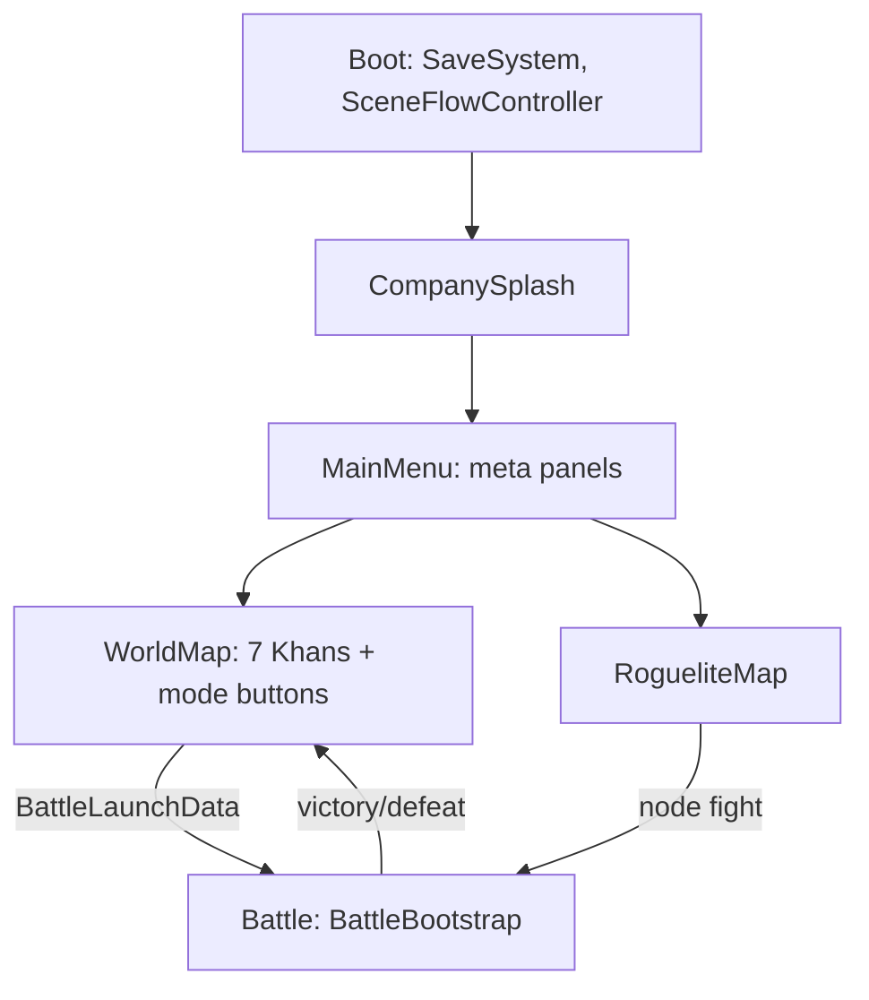
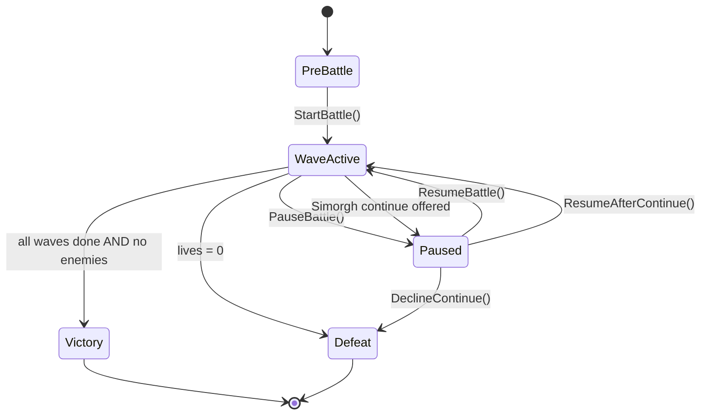
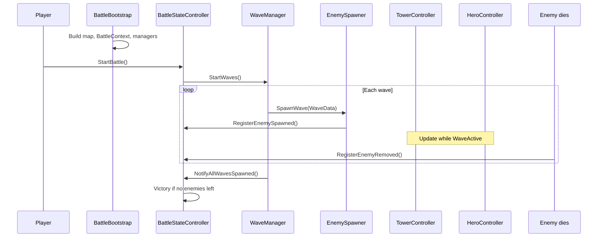
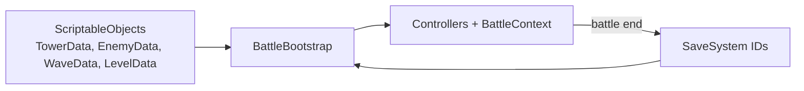

# Game Logic & Essentials

**Last updated:** 2026-06-04  
**Audience:** Developers and AI agents working in this repo  
**Purpose:** Fast onboarding — how the game thinks, who owns what, and where to look in code.

**Design canon:** [README_02](README_02_GAMEPLAY_VISUAL_UX_REPLAYABILITY.md) · [README_04](README_04_DEVELOPMENT_PRODUCTION_ROADMAP.md) (stable IDs)  
**Implementation truth:** [GODOT_PORT_STATUS.md](GODOT_PORT_STATUS.md) · [IMPLEMENTATION_STATUS.md](IMPLEMENTATION_STATUS.md)

| Read this when… | Use instead… |
|-----------------|--------------|
| You need **target design** (full rules) | [README_02](README_02_GAMEPLAY_VISUAL_UX_REPLAYABILITY.md) · [GAMEPLAY_SPEC.md](GAMEPLAY_SPEC.md) |
| You need **what works today** (✅/🟡/❌) | [IMPLEMENTATION_STATUS.md](IMPLEMENTATION_STATUS.md) |
| You need **player flow + asset gaps** | [GAMEPLAY_AND_ASSET_REQUIREMENTS.md](GAMEPLAY_AND_ASSET_REQUIREMENTS.md) |
| You need **Godot folders and autoloads** | [GODOT_ARCHITECTURE.md](GODOT_ARCHITECTURE.md) |
| You need **managers, scenes, save fields** | [TECHNICAL_DESIGN.md](TECHNICAL_DESIGN.md) |
| Unity archive only | [UNITY_ARCHITECTURE.md](UNITY_ARCHITECTURE.md) |

---

## 1. Identity in one paragraph

**Shahnameh TD** is a mobile landscape 2D **active tower-defense roguelite**. The player places towers, moves a hero, manages regional corruption, and clears waves. Three systems differentiate it from generic TD:

1. **Sacred Fire vs Corruption** — map regions have light levels; darkness weakens or **hijacks** towers; Sacred Fire cleanses territory.
2. **Fate Weaving** — Pardeh Break modifiers are **boon + curse** (`BlessingData` / Fate cards).
3. **Morale** — a 0–100 battle momentum meter that buffs or debuffs combat tempo.

**Currencies (design):**

| Currency | Scope | Purchasable? |
|----------|-------|--------------|
| Gold | In-battle build/upgrade/repair | No |
| Sacred Fire | Cleanse, braziers, anti-hijack | No |
| Farr | Meta mastery, unlocks, collections | No direct purchase |

Use **stable lowercase_snake_case IDs** in resources (`hero_id`, `tower_id`, …) — never display names in gameplay code ([README_04](README_04_DEVELOPMENT_PRODUCTION_ROADMAP.md)).

Post-campaign **Hunt for Zahhak**: 7 Khan seals + Star Iron → Damavand anchors → bind Zahhak (see [GAME_HANDOFF.md](GAME_HANDOFF.md)). Campaign finale map: **Damavand Binding** (8th battlefield).

---

## 2. Architecture rules (do not break these)

From `.cursor/rules/02-gameplay-architecture.mdc` — enforce in all battle code:

| System | Owns | Must NOT |
|--------|------|----------|
| `WaveManager` | Wave timing, spawn schedule, wave-end gates | Enemy combat stats, damage math |
| `EnemySpawner` | Spawn from `WaveData` | Decide stats (comes from `EnemyData`) |
| `EnemyController` | Movement, HP, status, death, rewards | Wave progression, UI |
| `TowerController` | Targeting, cooldown, upgrades, hijack state | Direct HUD updates |
| `ProjectileController` | Fly to target, hit resolution | Wave state |
| `BattleStateController` | PreBattle / WaveActive / Paused / Victory / Defeat | Tower targeting |
| `BattleEconomy` | Gold + Sacred Fire in battle | Meta shop prices |
| `HeroController` | Move, attack, skills, tether, energy | Wave spawning |

**Hub object:** `BattleContext` wires all battle services. Created and filled in `BattleBootstrap.Awake()`.

**Data rule:** ScriptableObjects hold **design only**. Runtime HP, level, corruption, etc. live on controllers or runtime state — never mutate shared `.asset` files during play.

**IDs:** Stable `lowercase_snake_case` string IDs for save/analytics — never display names.

---

## 3. Scene and meta flow

**Launching a battle**

1. `WorldMapController` (or roguelite / daily / endless UI) sets `BattleLaunchData.SelectedLevel`, flags (`IsHuntMode`, `IsRogueliteRun`, `IsEndlessMode`, etc.).
2. `SceneFlowController` async-loads **Battle** scene.
3. `BattleBootstrap` reads launch data + `LevelData` → builds map, initializes `BattleContext`, optionally `autoStartBattle`.

**Save:** `SaveSystem` loads in Boot / World Map; campaign unlocks, currencies, shards, hunt progress persist there.

---

## 4. Battle state machine

| State | `Time.timeScale` | Typical triggers |
|-------|------------------|------------------|
| `PreBattle` | 1 (or unchanged) | Scene load; player builds |
| `WaveActive` | 1 or 2× (`SetSpeedMultiplier`) | Start Wave button |
| `Paused` | 0 | Pause UI; Simorgh Feather continue prompt |
| `Victory` | 0 | All waves spawned + cleared; Damavand trigger; debug |
| `Defeat` | 0 | Lives depleted (after optional continue) |

**Enemy counting:** `BattleStateController` increments on spawn, decrements on death/removal, then calls `CheckVictoryConditions()` when `WaveManager.AllWavesComplete` and `_activeEnemies <= 0`.

**Lives:** `LivesController` → on zero calls `HandleLivesDepleted()` → optional `SimorghContinueService` pause → defeat or continue.

---

## 5. Battle lifecycle (one frame of logic)

### Wave modes (`WaveManager`)

| Mode | When | Behavior |
|------|------|----------|
| **Campaign** | Default `LevelData.waves[]` | Fixed wave list; victory when all cleared |
| **Endless** | `BattleLaunchData.IsEndlessMode` | `EndlessWaveGenerator` loops until defeat |
| **Hunt** | `BattleLaunchData.IsHuntMode` | `HuntWaveGenerator` milestones; `HuntDirector` may end loop at wave 100 + finale rules |

Pre-wave **gates** (e.g. Blood Oath UI) register on `WaveManager` and run as coroutines before spawns.

---

## 6. `BattleContext` — service map

All battle systems receive the same `BattleContext` reference (set in `BattleBootstrap`).

| Property | Type | Responsibility |
|----------|------|----------------|
| `LevelData` | `LevelData` | Waves, map layout, flags, starting gold |
| `StateController` | `BattleStateController` | Win/loss/pause/speed |
| `WaveManager` | `WaveManager` | Wave coroutines |
| `EnemySpawner` | `EnemySpawner` | Prefab spawn + pool |
| `Economy` | `BattleEconomy` | Gold, Sacred Fire, kill rewards |
| `Lives` | `LivesController` | Gate leaks |
| `TowerManager` | `TowerManager` | Build spots, placement, sell |
| `HeroManager` | `HeroManager` | Hero spawn + input routing |
| `Blessings` | `BlessingSystem` | Fate/boon modifiers this run |
| `Corruption` | `MapLightManager` | Regional light, cleanse, hijack |
| `Morale` | `MoraleController` | 0–100 momentum |
| `Chrono` | `ZervanDialController` | Rewind snapshots |
| `Couplet` | `CoupletComboManager` | Rhyme Window |
| `Khan` | `KhanEscalationManager` | Boss HP phases |
| `Forge` | `AncestralForgeManager` | Adjacent tower hybrids |
| `Director` | `AhrimanDirector` | Counter-pick boss modifiers |
| `Tribute` | `ZahhakTributeManager` | Serpent sacrifice timer |
| `HuntDirector` | `HuntDirector` | Hunt finale / shard pacing |
| `Paths` | `WaypointPath` list | Enemy routes (multi-path supported) |

Deep systems are also spawned/configured in `BattleBootstrap.ConfigureDeepSystems()` if not on the scene.

---

## 7. Core combat logic

### Enemies

1. Spawned at path start with stats from `EnemyData` (HP, speed, armor, gold reward, tags).
2. `PathFollower` advances along `WaypointPath` (static or dynamic A* when `LevelData.useDynamicPathfinding`).
3. Reach gate → `LivesController` loses life → morale drop.
4. Death → gold/Sacred Fire via `BattleEconomy`, morale gain, `RegisterEnemyRemoved()`, pool return.

**Corruptors** reduce regional light as they pass; at **light 0** nearby towers become **hijacked** (attack allies/hero until hero damages tower to purge).

### Towers

1. Player taps **build spot** → `TowerBuildPanel` (build / upgrade / sell / cleanse / brazier).
2. `TowerController` picks targets by mode (first, last, strong, etc.), respects range and cooldown.
3. Damage scales with regional light: below 30, efficiency `E = L/30` on cooldown and range.
4. Projectiles from pool; on-hit may apply `StatusEffectData`.
5. **Veterancy:** `TowerVeterancyManager` awards in-run stars from damage + cleanses.

### Hero

1. Tap ground → move (`HeroManager`).
2. Drag to tower → **Sacred Tether** (`HeroSacredTetherDrag`): attack-speed bonus, energy drain.
3. Passive cleanse ticks in current `MapRegion`.
4. Skills via HUD; bonus inside **Rhyme Window** from `CoupletComboManager`.
5. Offensive tether to Zahhak (Hunt finale) slows boss and drains energy.

### Damage

- `DamageInfo` carries amount, `DamageType`, source tags.
- `IDamageable.TakeDamage()` on enemies, towers (purge), hero.
- Bosses may apply runtime resistances from `BossModifierData` via `AhrimanDirector`.

---

## 8. Resources (battle)

| Resource | Earned | Spent on |
|----------|--------|----------|
| **Gold** | Enemy kills, wave rewards | Build, upgrade, sell refund |
| **Sacred Fire** | Corruptor kills, fire towers, shrines, relics | Region cleanse, braziers, Qanat teleport |
| **Lives** | Level start + bonuses | Lost when enemy reaches gate |
| **Hero energy** | Morale high, boons | Sacred Tether drain |

Meta currencies (honor, diamonds, shards) are handled in `Meta/*` services and `SaveSystem`, not `BattleEconomy`.

---

## 9. Signature systems — logic summary

### Sacred Fire vs Corruption

- One `MapRegion` per build spot (simplified vs spec’s multi-segment regions).
- Light 0–100; corruptors and decay reduce it.
- `TowerController.OnLightChanged` → weaken or hijack.
- Spend Sacred Fire on spot UI to cleanse or place brazier (+light, triggers path recalc).

### Fate Weaving

- `BlessingData`: boon fields + curse fields → `BlessingSystem` → `BattleRuntimeModifiers`.
- Draft UI: `BlessingChoicePanel` / `FateDraftController`; rerolls via `FateRerollService`.
- Level flag: `LevelData.requiresPreBattleFateDraft`.

### Morale

- `MoraleController`: kills/skills/corruption/lives/hero down adjust 0–100.
- High: tower attack speed, hero energy regen.
- Low: barracks penalty (when barracks exist), boss intimidation.

### Zervan Dial (rewind)

- Ring buffer ~5s of snapshots (enemies, regions, hero pos; tower HP/energy restore incomplete — see IMPLEMENTATION_STATUS).

### Khan phases

- Any enemy with `isBoss`: every 15% HP → phase event → regional light penalty + `AhrimanDirector` picks family counter.

### Zahhak / Damavand (Hunt + roguelite flags)

- `ZahhakBossController`: immune to tower damage; hero damage only.
- `ZahhakTributeManager`: periodic max-level tower sacrifice or HP/regional penalty.
- Win: Zahhak in `DamavandMountainArea` + ≥2 adjacent **Forge** family towers → `TriggerVictory()`.
- Hunt: **100 Star Iron → 1 anchor** (3 per bind); **7 Khan seals + anchors + wave 50** for finale; repeatable with **Zahhak Fury** after each bind.

---

## 10. `LevelData` flags (wiring checklist)

| Flag | Effect |
|------|--------|
| `requiresPreBattleFateDraft` | Fate pick before waves |
| `useDynamicPathfinding` | A* paths weighted by regional light |
| `enableZahhakTribute` | Serpent tribute timer |
| `enableDamavandBoss` | Zahhak + mountain finale setup |

Roguelite launches often force tribute via bootstrap even if level asset omits the flag.

---

## 11. Data → runtime pipeline

**Authoring**

- Levels: `LevelData` + `mapLayout` (paths, build spots, decor) — edit in Scene via `LevelMapEditor`.
- Waves: `WaveData` entries referenced by level.
- Content IDs: must stay stable once players have saves.

**Editor setup:** **ShahnamehTD → Generate Project Setup** regenerates scenes, assigns tower families, deep-system assets, and catalog fallbacks.

---

## 12. Key scripts (quick file map)

| Area | Path |
|------|------|
| Battle entry | `Scripts/Battle/BattleBootstrap.cs` |
| Context | `Scripts/Battle/BattleContext.cs` |
| State | `Scripts/Battle/BattleStateController.cs` |
| Waves | `Scripts/Battle/WaveManager.cs` |
| Launch payload | `Scripts/Battle/BattleLaunchData.cs` |
| Enemies | `Scripts/Enemies/EnemyController.cs` |
| Towers | `Scripts/Towers/TowerController.cs` |
| Hero | `Scripts/Heroes/HeroController.cs` |
| Light/corruption | `Scripts/Battle/MapLightManager.cs` |
| Design data | `Scripts/Data/*.cs` |
| Meta / map | `Scripts/Meta/WorldMapController.cs`, `SceneFlowController.cs` |
| Save | `Scripts/Meta/SaveSystem.cs` |
| HUD | `Scripts/UI/BattleHUDController.cs` |

Namespaces: `ShahnamehTD.{Battle,Enemies,Towers,Heroes,Data,UI,Meta,Core}`.

---

## 13. Main points to remember

1. **Fun first:** Core loop is waves + towers + hero + lives; meta modes layer on top.
2. **BattleContext is the wiring contract** — new battle features should hang off it, not static singletons.
3. **State lives in controllers** — SOs are templates only.
4. **Victory has multiple paths** — wave clear (campaign), boss HP (generic), Damavand trigger (Hunt finale).
5. **TowerFamily must be set on assets** — forge, Ahriman counters, tether refraction depend on it (run project setup).
6. **Hunt ≠ Roguelite** — Hunt is shard/grind survival on world map; Roguelite is separate node map scene.
7. **Art gaps ≠ logic gaps** — many systems are code-complete but need VFX/UI per [VISUAL_AND_VFX_SPEC.md](VISUAL_AND_VFX_SPEC.md).
8. **Check IMPLEMENTATION_STATUS before promising features** — it tracks ✅/🟡/❌ per mechanic.

---

## 14. How to test (minimum)

1. Godot: run `tools/import_unity_refs.ps1` after pulling archive changes, or regenerate levels via `tools/generate_levels.ps1`.
2. Open **Boot** → Play → Main Menu → World Map → **Khan 1**.
3. Place tower → **Start Wave** → enemies path → leak reduces lives → clear waves → victory.
4. **level_03:** pre-battle fate draft; test tether drag, Sacred Fire cleanse, rewind hold.
5. After Khan 7: verify Hunt button unlock; Hunt battle for shard milestones (if setup committed).

Edge cases: pause at 2× speed, hijacked tower at light 0, sell tower refund, daily challenge once-per-day claim.

---

## 15. Doc index (full set)

| Document | Contents |
|----------|----------|
| [GAME_LOGIC_AND_ESSENTIALS.md](GAME_LOGIC_AND_ESSENTIALS.md) | This file — logic + onboarding |
| [GAMEPLAY_SPEC.md](GAMEPLAY_SPEC.md) | Complete design specification |
| [IMPLEMENTATION_STATUS.md](IMPLEMENTATION_STATUS.md) | Playable vs partial vs missing |
| [GAMEPLAY_AND_ASSET_REQUIREMENTS.md](GAMEPLAY_AND_ASSET_REQUIREMENTS.md) | Player flow + asset checklist |
| [PRD.md](PRD.md) | Product scope, MVP vs launch |
| [TECHNICAL_DESIGN.md](TECHNICAL_DESIGN.md) | Scenes, managers, save, pooling |
| [UNITY_ARCHITECTURE.md](UNITY_ARCHITECTURE.md) | Folders, namespaces, prefabs |
| [DEVELOPMENT_ROADMAP.md](DEVELOPMENT_ROADMAP.md) | Phase plan |
| [VISUAL_AND_VFX_SPEC.md](VISUAL_AND_VFX_SPEC.md) | Art/VFX readability |
| [ASSET_PIPELINE.md](ASSET_PIPELINE.md) | AI sprite generation rules |
| [LIVEOPS_AND_RETENTION.md](LIVEOPS_AND_RETENTION.md) | Economy fairness, events |
| [UNITY_SETUP.md](UNITY_SETUP.md) | Editor/project setup steps |

**Maintenance:** Update this file when battle ownership, `BattleContext` fields, or core win/loss rules change.
