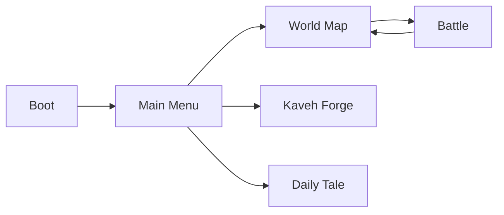

# Gameplay, Mechanics & Asset Requirements

**Last updated:** 2026-06-09  
**Purpose:** Player-facing overview of how the game works today, what is implemented in code, and which art/audio assets are still needed.  
**Design canon:** [design/02](../design/02-gameplay-ux.md) · [design/01](../design/01-art-phases.md)  
**Related:** [engineering/game-logic.md](../engineering/game-logic.md) · [spec/gameplay.md](../spec/gameplay.md) · [engineering/implementation-tracker.md](../engineering/implementation-tracker.md) · [engineering/project-status.md](../engineering/project-status.md) · [art/pipeline.md](../art/pipeline.md) · [art/visual-vfx.md](../art/visual-vfx.md)

---

## 1. Front-end flow (how you start playing)

| Step | Scene | What happens |
|------|-------|----------------|
| 1 | **Boot** | Loads save v9, autoloads, `SceneFlowController` → Main Menu (no company splash). |
| 2 | **MainMenu** | **Play** → World Map; **Daily Tale**; **Kaveh's Forge**; settings. Store UI is stub IAP ([design/03](../design/03-monetization.md)). |
| 3 | **WorldMap** | Campaign **Labours** 1–7 + Damavand; **Campaign Run**; Horde; Brothers; Throne; Gauntlet; Endless + Hunt (7 seals); **Equipment** + **Daily Missions** panels. |
| 4 | **Battle** | Shared battle scene. Victory → rewards → return to map or Campaign Run graph. |

**Test in Godot:** Open the repository root in Godot 4.6, press **F5** (boot) or **F6** (current scene). See [engineering/project-status.md](../engineering/project-status.md).

**First art milestone:** design/01 Phase 0 (Rostam, prototype HUD, Khan 1 map) then Phase 1 (four towers, Lion, core VFX).

---

## 2. Campaign — Seven Labours + Damavand

Rostam’s seven Labours + Damavand are the main campaign chain on the world map:

| # | Level ID | Display name (generated) | Boss |
|---|----------|--------------------------|------|
| T | `level_00_tutorial` | Sacred Fire Training | — |
| 1–7 | `level_01` … `level_07` | Labour 1–7 | Per-Labour boss |
| 8 | `level_08_damavand` | Damavand Binding | Zahhak |

**Progression:** Tutorial gates Labour 1. Linear unlock; **Labour seal** per first-clear with default objective. **7 seals** → Endless, Gauntlet, Barracks tower, Hunt (+ Elite forge). Full table: [main-gameplay.md](../product/main-gameplay.md) §5.

---

## 3. Side and post-campaign modes

| Mode | Unlock | Notes |
|------|--------|-------|
| **Campaign Run** | Tutorial | Primary roguelite graph — tower draft, scavenging, relics |
| **Horde** | Tutorial | 15 waves × 8 maps → Serpent Spire |
| **Brothers in Arms** | Tutorial | Local co-op — Zal + Sohrab |
| **Defend the Throne** | Tutorial | Radial arena `level_throne_arena` |
| **Haft-Khan Gauntlet** | 7 seals | 7-boss rush; timer + ghost PB |
| **Endless** | 7 seals | Labour 1 infinite waves |
| **Hunt for Zahhak** | 7 seals + Elite forge | Damavand hunt binding |
| **Daily Tale** | Main menu | Seeded Labour 1 daily |
| **Equipment / Daily Missions** | World map panels | 7 sets × 4 pieces; 3 missions/day |
| **Roguelite (legacy)** | Deprecated | Save migrates to Campaign Run |

Full detail: [product/main-gameplay.md](../product/main-gameplay.md) §6–7.

---

## 4. Core battle gameplay

### Standard tower defense loop

1. **Waves** spawn enemies along waypoints (`WaveManager`, `EnemySpawner`).
2. **Build pads:** tap empty pad → **build radial** (afford-gated) → build for gold.
3. **Occupied pad:** **manage radial** — upgrade, sell, purify, Sacred Tether; **range ring** on select.
4. **Lives** decrease when enemies leak; **0 lives** → defeat (optional **Simorgh Feather** continue once).
5. Clear all waves → **Victory** (results panel: waves, lives, coins, hero XP, veterancy souls).

### Hero (Rostam / Zal)

- **Tap ground** to move.
- **Skill button** (bottom-left cluster with portrait placeholder).
- **Sacred Tether:** drag hero to tower for attack-speed buff; drains energy.
- **Sacred Fire:** spend on **Cleanse** / **Brazier** for selected build spot region.
- **Qanat** (levels with qanat nodes): fast-travel network when hero is near a node.

### Signature systems (identity)

| System | Player-facing effect |
|--------|-------------------|
| **Regional light / corruption** | Corruptors darken regions; towers weaken; at 0 light towers **hijack** and attack allies until hero purges. |
| **Sacred Fire** | Currency from corruptor kills; cleanse regions and light braziers. |
| **Morale** | Slider top-left; high morale boosts towers/hero; low morale penalizes. |
| **Fate weaving** | Pre-battle draft on some levels; double-edged boons/curses in run. |
| **Zervan Dial** | Hold **Rewind** to snapshot-restore enemies and region lights (tower HP/hero energy restore incomplete). |
| **Khan phases** | Bosses trigger phase banners + regional penalties every 15% HP. |
| **Blood Oath** | Milestone waves: accept/decline risky oath for rewards. |
| **Ahriman Director** | Adapts boss resistances to your most-used tower family (needs family tags on tower assets). |
| **Prophecy** | Optional objective text on HUD when active. |

### Battle HUD layout (landscape mobile)

| Zone | Elements |
|------|----------|
| Top left | Lives, gold, wave, Sacred Fire, morale |
| Top right | Pause (with overlay), 1×/2×, settings, cleanse, brazier, qanat, rewind |
| Center banners | Khan phase, director warning, tribute hunger |
| Bottom left | Hero portrait (placeholder) + skill |
| Bottom center | Tower build cards |
| Bottom right | Relics / organ drag / energy (runtime overlay) |
| Full screen | Victory/defeat results, Simorgh continue, blood oath, fate draft |

---

## 5. Meta systems (menus & world map)

Available from **Main Menu** and **World Map** toolbars:

| Feature | Purpose |
|---------|---------|
| Daily Challenge | Date-seeded level + modifier + fate; once-per-day claim |
| Daily Bazaar | Rotating shop packs + free daily claim |
| Hero Camp | Hero level/XP, honor upgrades |
| Towers | Unlock towers with soft currency |
| Relics | Buy/equip up to 3 relics for battle |
| Quests | Daily build/kill/win quests |
| Cosmetics | Hero skins |
| Star Altar | Tower lineage upgrades (souls) |
| Ferdowsi Archive | Chronicle pages / prophecies |
| Kaveh Forge | Offline shard drip + premium boost |
| Premium | Simorgh blessing, feathers, diamonds (stub IAP) |
| Battle Pass / Weekly Trial | Meta progression stubs with UI |
| Roguelite | Separate map expedition |

---

## 6. Implemented vs not (summary matrix)

| Area | Status | Notes |
|------|--------|-------|
| Boot → Splash → Menu → World → Battle | ✅ | When scenes and `resources/` catalog exist |
| 7 Khan levels + catalog | 🟡 | Design target; author `.tres` per design/04 |
| Endless unlock (7 Khans) | ✅ | `SaveSystem.AllKhansCompleted()` |
| Hunt unlock (Khan 7 talisman) | ✅ | Existing Damavand quest |
| Async loading + fade | ✅ | `SceneFlowController` |
| Main menu all meta panels | ✅ | Shared generator with world map |
| Battle HUD (pause overlay, portrait, results, Simorgh, hunt label) | 🟡 | Wire in `scenes/battle/` + HUD scripts |
| Real splash/menu/Khan art | 🎨 | Placeholders / colored UI |
| Tower families on `.tres` | 🟡 | Assign in resources or validate script |
| Organ / boss modifier / combo `.tres` | 🟡 | Folders may be empty until authored |
| Zervan full rewind (tower HP, hero energy) | 🟡 | Partial |
| 6 heroes / 6 tower families (full launch) | ❌ | 2 heroes, 3 towers in slice |
| Real IAP store | ❌ | `StubPurchaseProvider` |

---

## 7. Assets needed (checklist)

Use [art/pipeline.md](../art/pipeline.md) for generation rules (green screen, pivots, 12-frame sheets).

### UI & branding (high priority)

| Asset | Use | Notes |
|-------|-----|-------|
| Company splash logo / title art | CompanySplash scene | Persian miniature style, no tiny text |
| Main menu background | MainMenu | Landscape 16:9, ornamental frame |
| Main menu Play button icon | Primary CTA | Large touch target |
| HUD icon set | Pause, speed, settings, cleanse, brazier, qanat, rewind | Replace text buttons |
| Hero portraits | Rostam, Zal, future heroes | Center pivot; 128–256px |
| World map node icons | 7 Khans locked/unlocked/complete | Readable at mobile size |
| Victory / defeat frames | Results panels | Gold/defeat palette |

### Characters & enemies

| Asset | Use |
|-------|-----|
| Hero sprites + anim sheets | Rostam, Zal (+ 4 future heroes) |
| Khan bosses 1–7 | Mythic Lion, Mirage, Azhdaha, Witch, Oulad, Arzhang, Div-e Sepid |
| Grunt, runner, brute, corruptor, elite | Campaign + hunt |
| **Zahhak** boss | Hunt finale + tribute scenarios |
| Enemy `enemy_zahhak` scene | `scenes/prefabs/enemies/` when authored |

### Towers & VFX

| Asset | Use |
|-------|-----|
| Arrow, cannon, frost, **forge** tower sprites | Build cards + world |
| Projectiles + impact VFX | Combat readability |
| Sacred tether beam | Hero ↔ tower |
| Region corruption overlay | Map spots (per [visual-vfx.md](visual-vfx.md)) |
| Hijack / cleanse / brazier VFX | Signature readability |

### Maps

| Asset | Use |
|-------|-----|
| World map illustrated backdrop | 7 node path |
| Per-Khan battle map tiles / props | `LevelData.mapLayout` |
| Damavand mountain + chain milestone UI | Hunt finale |

### Audio

| Asset | Use |
|-------|-----|
| Menu music, battle music, boss sting | Loop-friendly |
| UI click, build, wave start, victory, defeat | Short SFX |
| Khan phase / tribute warning | 1–2s stingers |

### Resource content (design data, not art)

Author or validate on disk (see `tools/validate_resources.ps1`):

- `level_04`–`level_07`, `level_hunt` `.tres`
- Tower **family** tags on tower `.tres`
- `TowerCombinationData`, `OrganMutationData`, `BossModifierData` resources (if empty)

---

## 8. How to test (after setup)

1. Godot: validate resources (`tools/validate_resources.ps1`) and open project (F5)
2. Open **Boot** scene → Play
3. Splash → Main Menu → **Play Campaign**
4. World map: 7 nodes; Endless/Hunt locked until Khans done
5. Play `level_01` → verify HUD (pause overlay, build cards, victory panel)
6. (Dev) Complete all Khans in save or play through → Endless + Hunt unlock

**Edge cases**

- Tap splash to skip
- Pause during wave → overlay visible; resume via Pause
- Defeat with feathers → Simorgh panel before final defeat
- Hunt mode → shard progress label top-left area

---

## 9. Maintenance

Update this doc when:

- Adding scenes to the front-end flow
- Changing Khan count or unlock rules
- Shipping new art that replaces placeholders
- Closing a 🟡/❌ row in the matrix above
