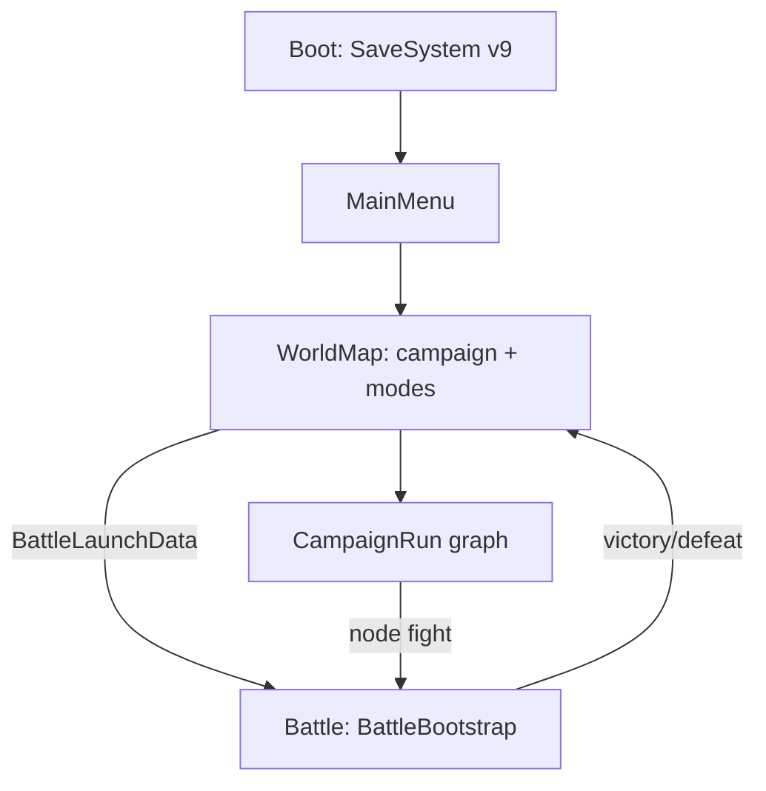
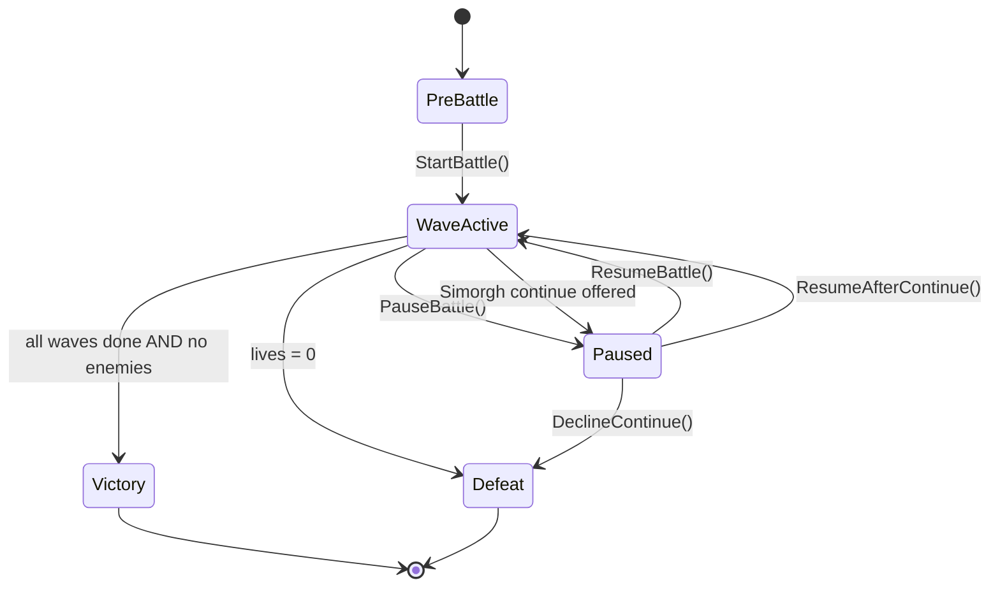
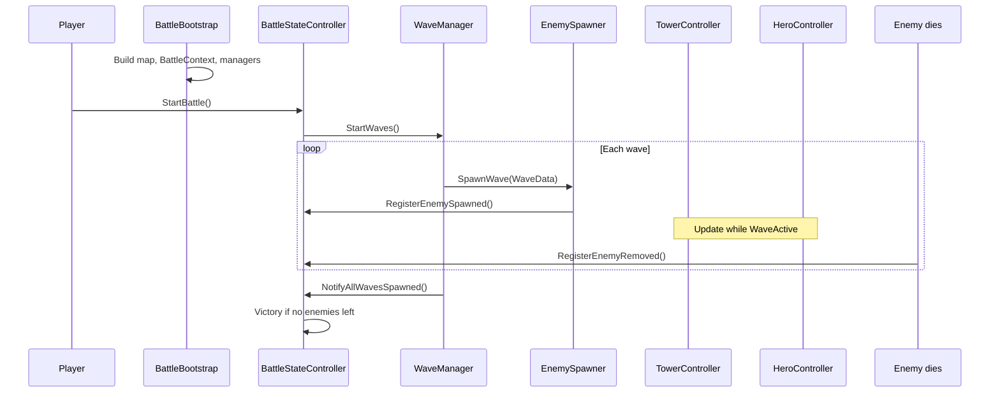
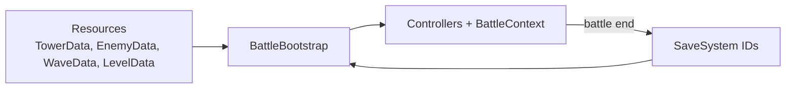

# Game Logic & Essentials

**Last updated:** 2026-06-09  
**Audience:** Developers and AI agents working in this repo  
**Purpose:** Fast onboarding — how the game thinks, who owns what, and where to look in code.

**Design canon:** [design/02](../design/02-gameplay-ux.md) · [design/04](../design/04-production-roadmap.md) (stable IDs)  
**Implementation truth:** [engineering/project-status.md](engineering/project-status.md) · [engineering/implementation-tracker.md](engineering/implementation-tracker.md)

| Read this when… | Use instead… |
|-----------------|--------------|
| You need **target design** (full rules) | [design/02](../design/02-gameplay-ux.md) · [spec/gameplay.md](../spec/gameplay.md) |
| You need **what works today** (✅/🟡/❌) | [engineering/implementation-tracker.md](engineering/implementation-tracker.md) |
| You need **player flow + asset gaps** | [art/content-checklist.md](../art/content-checklist.md) |
| You need **Godot folders and autoloads** | [engineering/architecture.md](engineering/architecture.md) |
| You need **managers, scenes, save fields** | [engineering/technical-design.md](engineering/technical-design.md) |
| You need **handoff / code map** | [engineering/handoff.md](engineering/handoff.md) |

---

## 1. Identity in one paragraph

**Shahnameh TD** is a mobile landscape 2D **active tower-defense roguelite**. The player places towers, moves a hero, manages regional corruption, and clears waves. Three systems differentiate it from generic TD:

1. **Sacred Fire vs Corruption** — map regions have light levels; darkness weakens or **hijacks** towers; Sacred Fire cleanses territory.
2. **Fate Weaving** — Pardeh Break modifiers are **boon + curse** (`BlessingData` / Fate cards).
3. **Morale** — a 0–100 battle momentum meter that buffs or debuffs combat tempo.

**Currencies (design):**

| Currency | Scope | Purchasable? |
|----------|-------|--------------|
| Gold | In-battle build/upgrade/repair | No |
| Sacred Fire | Cleanse, braziers, anti-hijack | No |
| Farr | Meta mastery, unlocks, collections | No direct purchase |

Use **stable lowercase_snake_case IDs** in resources (`hero_id`, `tower_id`, …) — never display names in gameplay code ([design/04](../design/04-production-roadmap.md)).

Post-campaign **Hunt for Zahhak**: 7 Khan seals + Star Iron → Damavand anchors → bind Zahhak (see [engineering/handoff.md](engineering/handoff.md)). Campaign finale map: **Damavand Binding** (8th battlefield).

---

## 2. Architecture rules (do not break these)

From `.cursor/rules/code-battle.mdc` — enforce in all battle code:

| System | Owns | Must NOT |
|--------|------|----------|
| `WaveManager` | Wave timing, spawn schedule, wave-end gates | Enemy combat stats, damage math |
| `EnemySpawner` | Spawn from `WaveData` | Decide stats (comes from `EnemyData`) |
| `EnemyController` | Movement, HP, status, death, rewards | Wave progression, UI |
| `TowerController` | Targeting, cooldown, upgrades, hijack state | Direct HUD updates |
| `ProjectileController` | Fly to target, hit resolution | Wave state |
| `BattleStateController` | PreBattle / WaveActive / Paused / Victory / Defeat | Tower targeting |
| `BattleEconomy` | Gold + Sacred Fire in battle | Meta shop prices |
| `HeroController` | Move, attack, skills, tether, energy | Wave spawning |

**Hub object:** `BattleContext` wires all battle services. Created and filled in `BattleBootstrap.Awake()`.

**Data rule:** Resources hold **design only**. Runtime HP, level, corruption, etc. live on controllers or runtime state — never mutate shared `.tres` files during play.

**IDs:** Stable `lowercase_snake_case` string IDs for save/analytics — never display names.

---

## 3. Scene and meta flow

**Launching a battle**

1. `WorldMapController` (or Campaign Run / daily / endless / horde / gauntlet UI) sets `BattleLaunchData` — `level_id` + flags (`is_hunt_mode`, `is_campaign_run`, `is_horde_mode`, `is_gauntlet_mode`, etc.).
2. `SceneFlowController` async-loads **Battle** with optional preload overlay (`LevelAssetCollector`).
3. `BattleBootstrap` reads launch data + `LevelData` → builds map, initializes `BattleContext`, attaches `LabourMode` when `is_campaign_mode()`.

**Save:** `SaveSystem` v9 — campaign unlocks, forge, `campaign_run`, equipment, daily missions, gauntlet PB, hunt progress.

---

## 4. Battle state machine

| State | `Time.timeScale` | Typical triggers |
|-------|------------------|------------------|
| `PreBattle` | 1 (or unchanged) | Scene load; player builds |
| `WaveActive` | 1 or 2× (`SetSpeedMultiplier`) | Start Wave button |
| `Paused` | 0 | Pause UI; Simorgh Feather continue prompt |
| `Victory` | 0 | All waves spawned + cleared; Damavand trigger; debug |
| `Defeat` | 0 | Lives depleted (after optional continue) |

**Enemy counting:** `BattleStateController` increments on spawn, decrements on death/removal, then calls `CheckVictoryConditions()` when `WaveManager.AllWavesComplete` and `_activeEnemies <= 0`.

**Lives:** `LivesController` → on zero calls `HandleLivesDepleted()` → optional `SimorghContinueService` pause → defeat or continue.

---

## 5. Battle lifecycle (one frame of logic)

### Wave modes (`WaveManager`)

| Mode | When | Behavior |
|------|------|----------|
| **Campaign** | `is_campaign_mode()` | Procedural waves via `CampaignWaveTemplates` — 10-wave master blocks; 30–100 waves per map |
| **Endless** | `is_endless_mode` | `EndlessWaveGenerator` loops until defeat |
| **Hunt** | `is_hunt_mode` | `HuntWaveGenerator` + `HuntController` binding sequence |
| **Horde** | `is_horde_mode` | 15 fixed waves per map |
| **Gauntlet** | `is_gauntlet_mode` | 7-boss chain; no Pardeh/Vow |

**Campaign wave cadence:**
- **Pardeh Break** every **5 cleared waves** (`_should_offer_pardeh()`); waits for enemy clear before offering.
- **Hero's Vow** every **10 cleared waves** (`VowOfferController`).
- **Mini-boss** every 10th wave within 10-wave blocks.

**10-wave block roles** (`CampaignWaveTemplates`): Bait (1–3) → Trap (4–5) → Hijack (6–8) → Push (9) → Mini-boss (10).

**Labour modes:** `BattleBootstrap._attach_labour_mode()` attaches `LabourModeFactory` overlay on campaign only.

Pre-wave **gates** (vow offer, Pardeh) register on `WaveManager` and run as coroutines before next wave spawns.

---

## 6. `BattleContext` — service map

All battle systems receive the same `BattleContext` reference (set in `BattleBootstrap`). Source: `scripts/battle/battle_context.gd`.

| Property | Responsibility |
|----------|----------------|
| `level_data` / `launch_data` | Waves, map layout, mode flags, starting gold |
| `state_controller` | Win/loss/pause/speed |
| `wave_manager` | Wave coroutines, Pardeh/Vow gates |
| `enemy_spawner` | Spawn + pool |
| `economy` | Gold, Sacred Fire, kill rewards, materials |
| `lives` | Gate leaks |
| `tower_manager` | Build pads, placement, sell, radials |
| `hero_manager` | Hero spawn + input routing |
| `map_light` | Regional light, cleanse, hijack |
| `objectives` | Map objectives + vow evaluation |
| `morale` | 0–100 momentum |
| `run_modifiers` | Fate cards, per-tower relic slots |
| `tower_resonance` | Adjacent tower combo buffs |
| `hunt` | Hunt binding + finale |
| `spell_controller` | Forge Token spells |
| `loot_drops` | Material scavenging |
| `companion_manager` / `rakhsh_mount` | Run companions + Rostam mount |
| `equipment_battle` | Equipped set rules |
| `naft_traps` | Rostam path oil + SF ignition |
| `labour_mode` | Campaign story overlay |
| `coop_players` | Brothers in Arms split economy |
| `active_allies` | Barracks-summoned units |
| `bridge` | `BattleContextBridge` signals for UI |

**Deferred (not on BattleContext today):** Zervan Dial, Ancestral Forge hybrids, Simorgh continue, Ahriman Director.

---

## 7. Core combat logic

### Enemies

1. Spawned at path start with stats from `EnemyData` (HP, speed, armor, gold reward, tags).
2. `PathFollower` advances along `WaypointPath` (static or dynamic A* when `LevelData.useDynamicPathfinding`).
3. Reach gate → `LivesController` loses life → morale drop.
4. Death → gold/Sacred Fire via `BattleEconomy`, morale gain, `RegisterEnemyRemoved()`, pool return.

**Corruptors** reduce regional light as they pass; at **light 0** nearby towers become **hijacked** (attack allies/hero until hero damages tower to purge).

### Towers

1. Player taps **build pad** → build radial (empty) or manage radial (occupied) + range ring.
2. `TowerController` picks targets by mode (first, last, strong, etc.), respects range and cooldown.
3. Damage scales with regional light: below 30, efficiency `E = L/30` on cooldown and range.
4. Projectiles from pool; on-hit may apply `StatusEffectData`.
5. **Veterancy:** `TowerVeterancyManager` awards in-run stars from damage + cleanses.

### Hero

1. Tap ground → move (`HeroManager`).
2. Drag to tower → **Sacred Tether** (`HeroSacredTetherDrag`): attack-speed bonus, energy drain.
3. Passive cleanse ticks in current `MapRegion`.
4. Skills via HUD; bonus inside **Rhyme Window** from `CoupletComboManager`.
5. Offensive tether to Zahhak (Hunt finale) slows boss and drains energy.

### Damage

- `DamageInfo` carries amount, `DamageType`, source tags.
- `IDamageable.TakeDamage()` on enemies, towers (purge), hero.
- Bosses may apply runtime resistances from `BossModifierData` via `AhrimanDirector`.

---

## 8. Resources (battle)

| Resource | Earned | Spent on |
|----------|--------|----------|
| **Gold** | Enemy kills, wave rewards | Build, upgrade, sell refund |
| **Sacred Fire** | Corruptor kills, fire towers, shrines, relics | Region cleanse, braziers, Qanat teleport |
| **Lives** | Level start + bonuses | Lost when enemy reaches gate |
| **Hero energy** | Morale high, boons | Sacred Tether drain |

Meta currencies (honor, diamonds, shards) are handled in `Meta/*` services and `SaveSystem`, not `BattleEconomy`.

---

## 9. Signature systems — logic summary

### Sacred Fire vs Corruption

- One `MapRegion` per build spot (simplified vs spec’s multi-segment regions).
- Light 0–100; corruptors and decay reduce it.
- `TowerController.OnLightChanged` → weaken or hijack.
- Spend Sacred Fire on spot UI to cleanse or place brazier (+light, triggers path recalc).

### Fate Weaving

- `BlessingData`: boon fields + curse fields → `BlessingSystem` → `BattleRuntimeModifiers`.
- Draft UI: `BlessingChoicePanel` / `FateDraftController`; rerolls via `FateRerollService`.
- Level flag: `LevelData.requiresPreBattleFateDraft`.

### Morale

- `MoraleController`: kills/skills/corruption/lives/hero down adjust 0–100.
- High: tower attack speed, hero energy regen.
- Low: barracks penalty (when barracks exist), boss intimidation.

### Zervan Dial (rewind)

- Ring buffer ~5s of snapshots (enemies, regions, hero pos; tower HP/energy restore incomplete — see [implementation-tracker.md](implementation-tracker.md)).

### Khan phases

- Any enemy with `isBoss`: every 15% HP → phase event → regional light penalty + `AhrimanDirector` picks family counter.

### Zahhak / Damavand (Hunt + roguelite flags)

- `ZahhakBossController`: immune to tower damage; hero damage only.
- `ZahhakTributeManager`: periodic max-level tower sacrifice or HP/regional penalty.
- Win: Zahhak in `DamavandMountainArea` + ≥2 adjacent **Forge** family towers → `TriggerVictory()`.
- Hunt: **100 Star Iron → 1 anchor** (3 per bind); **7 Labour seals + anchors + wave 50** for finale; repeatable with **Zahhak Fury** after each bind.

### Labour Modes (campaign overlays)

- **`LabourMode`** (`scripts/battle/labours/labour_mode.gd`): Node with `initialize(ctx)`, `_process`, wave/cleanse/boss hooks.
- **`LabourModeFactory`**: maps `level_id` → `labour_mode_id`; returns `null` for tutorial and non-campaign IDs.
- **`BattleBootstrap._attach_labour_mode`**: runs only when `BattleLaunchData.is_campaign_mode()`; wires `CombatEvents.wave_started/completed/cleanse_used` and `bridge.enemy_died`.
- Modes act through **existing systems**: extra spawns (`EnemySpawner`), hero HP, `MapLightManager` / cleanse, `runtime_modifiers` (`tower_damage_mult`, `vision_radius_mult`), `ObjectiveController` (Rescue).
- **`EnemyController`**: `is_targetable_by_tower()`, `is_decoy()`, `apply_venom()`, burrow flags for Dragon mode.

### Reward tower behaviors

| Tower | `AttackBehavior` | Notes |
|-------|------------------|-------|
| `tower_zahhak_serpent` | `TWIN` | Two targets; venom DoT + `_damage_taken_mult`; **Hunger** AS buff on venom kills (decays, capped, battle-reset) |
| `tower_rostam_barracks` | `BARRACKS` | No projectiles; spawns/resummons allies from `AllyUnitData`; level drives Vanguard → Bull-Mace Bearer |

Unlock: Serpent via `SaveSystem.record_horde_victory()` (all 8 hordes) or `StoreService`; Barracks via 7th Labour seal in `mark_level_cleared` or store. Both injected in `battle_bootstrap._apply_difficulty_and_unlocks` and gated in `tower_radial_build_controller`.

---

## 10. `LevelData` flags (wiring checklist)

| Flag | Effect |
|------|--------|
| `requiresPreBattleFateDraft` | Fate pick before waves |
| `useDynamicPathfinding` | A* paths weighted by regional light |
| `enableZahhakTribute` | Serpent tribute timer |
| `enableDamavandBoss` | Zahhak + mountain finale setup |
| `labour_mode_id` | Campaign overlay id (`mode_lion` … `mode_zahhak`); empty for tutorial |
| `labour_params` | Optional per-mode tuning dictionary |

Roguelite launches often force tribute via bootstrap even if level asset omits the flag.

---

## 11. Data → runtime pipeline

**Authoring**

- Levels: `LevelData` + `mapLayout` (paths, build spots, decor) — edit in Scene via `LevelMapEditor`.
- Waves: `WaveData` entries referenced by level.
- Content IDs: must stay stable once players have saves.

**Editor setup:** Run `tools/validate_resources.ps1` and Godot editor checks to ensure `.tres` cross-refs, tower families, and catalog fallbacks are valid.

---

## 12. Key scripts (quick file map)

| Area | Path (target layout) |
|------|------|
| Battle entry | `scripts/battle/battle_bootstrap.gd` |
| Context | `scripts/battle/battle_context.gd` |
| State | `scripts/battle/battle_state_controller.gd` |
| Waves | `scripts/battle/wave_manager.gd` |
| Launch payload | `scripts/battle/battle_launch_data.gd` |
| Enemies | `scripts/enemies/enemy_controller.gd` |
| Towers | `scripts/towers/tower_controller.gd` |
| Hero | `scripts/heroes/hero_controller.gd` |
| Light/corruption | `scripts/battle/map_light_manager.gd` |
| Design data | `scripts/data/*.gd` + `resources/*.tres` |
| Meta / map | `scripts/meta/world_map_controller.gd`, autoload `SceneFlowController` |
| Save | autoload `SaveSystem` |
| HUD | `scripts/ui/battle_hud_controller.gd` |

**Script layout:** `scripts/battle/`, `scripts/enemies/`, `scripts/towers/`, `scripts/heroes/`, `scripts/data/`, `scripts/ui/`, `scripts/meta/`, `scripts/core/`.

---

## 13. Main points to remember

1. **Fun first:** Core loop is waves + towers + hero + lives; meta modes layer on top.
2. **BattleContext is the wiring contract** — new battle features should hang off it, not static singletons.
3. **State lives in controllers** — SOs are templates only.
4. **Victory has multiple paths** — wave clear (campaign), boss HP (generic), Damavand trigger (Hunt finale).
5. **TowerFamily must be set on assets** — forge, Ahriman counters, tether refraction depend on it (run project setup).
6. **Hunt ≠ Roguelite** — Hunt is shard/grind survival on world map; Roguelite is separate node map scene.
7. **Art gaps ≠ logic gaps** — many systems are code-complete but need VFX/UI per [art/visual-vfx.md](../art/visual-vfx.md).
8. **Check [implementation-tracker.md](implementation-tracker.md) before promising features** — it tracks ✅/🟡/❌ per mechanic.

---

## 14. How to test (minimum)

1. Godot: run `tools/validate_resources.ps1` after pulling archive changes, or regenerate levels via `tools/generate_levels.ps1`.
2. Open **Boot** → Play → Main Menu → World Map → **Khan 1**.
3. Place tower → **Start Wave** → enemies path → leak reduces lives → clear waves → victory.
4. **level_03:** pre-battle fate draft; test tether drag, Sacred Fire cleanse, rewind hold.
5. After Khan 7: verify Hunt button unlock; Hunt battle for shard milestones (if setup committed).

Edge cases: pause at 2× speed, hijacked tower at light 0, sell tower refund, daily challenge once-per-day claim.

---

## 15. Doc index (full set)

| Document | Contents |
|----------|----------|
| [engineering/game-logic.md](engineering/game-logic.md) | This file — logic + onboarding |
| [spec/gameplay.md](../spec/gameplay.md) | Complete design specification |
| [engineering/implementation-tracker.md](engineering/implementation-tracker.md) | Playable vs partial vs missing |
| [art/content-checklist.md](../art/content-checklist.md) | Player flow + asset checklist |
| [PRD.md](../product/prd.md) | Product scope, MVP vs launch |
| [engineering/technical-design.md](engineering/technical-design.md) | Scenes, managers, save, pooling |
| [engineering/architecture.md](engineering/architecture.md) | Folders, autoloads, battle wiring |
| [engineering/project-status.md](engineering/project-status.md) | Playable today vs gaps |
| [product/roadmap.md](../product/roadmap.md) | Milestone-aligned roadmap |
| [art/visual-vfx.md](../art/visual-vfx.md) | Art/VFX readability |
| [art/pipeline.md](../art/pipeline.md) | AI sprite generation rules |
| [liveops/retention.md](../liveops/retention.md) | Economy fairness, events |
| [engineering/handoff.md](engineering/handoff.md) | Onboarding + code map |

**Maintenance:** Update this file when battle ownership, `BattleContext` fields, or core win/loss rules change.
