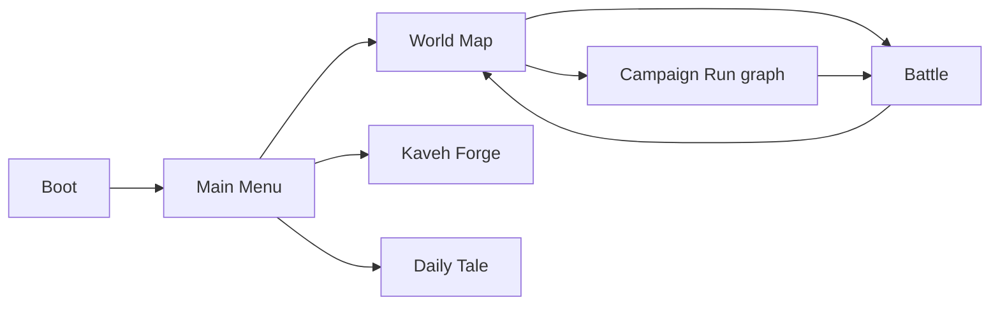
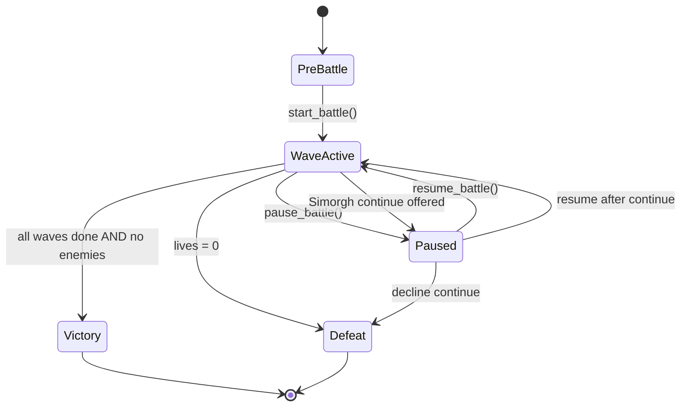
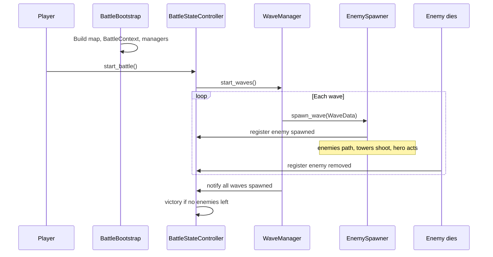
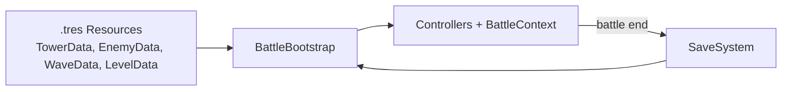

# Engineering Handoff

**Last updated:** 2026-06-09  
**Audience:** New designers, programmers, artists, or collaborators  
**Purpose:** What the game is, how it plays, and **where Godot code lives**.

**Design canon:** [../index.md](../index.md) → [../design/00-project-index.md](../design/00-project-index.md) · [../design/02-gameplay-ux.md](../design/02-gameplay-ux.md)  
**Repo today:** [project-status.md](project-status.md) — full playable build (10+ modes, 8 campaign maps, meta progression).  
**Full player inventory:** [../product/main-gameplay.md](../product/main-gameplay.md) · **Content IDs:** [../spec/entities-and-gameplay.md](../spec/entities-and-gameplay.md)

**Engine:** Godot 4.6 — repository root (`project.godot`)

**First production target:** Khan 1 vertical slice only until testers **voluntarily replay** ([design/00](../design/00-project-index.md)). Player-facing campaign label: **Seven Labours of Rostam**.

---

## 1. What this game is

**Shahnameh TD** is a **mobile landscape 2D active tower-defense roguelite** inspired by the **Shahnameh**, Persian mythology, Zoroastrian fire symbolism, and **Persian miniature** art.

It plays like Kingdom Rush–style TD with an **active hero**, but identity comes from **Sacred Fire vs corruption**, tower hijacking, Pardeh Breaks, and Fate cards — not Persian decoration on a generic TD.

**Core promise:** Hold back Ahriman’s darkness with Sacred Fire while Shahnameh heroes and mythic towers defend a battlefield that can **fight back** — corrupting your own towers — across runs shaped by **double-edged Fates**.

### Three identity pillars

| Pillar | What it is | Player feel |
|--------|------------|-------------|
| **Sacred Fire vs Corruption** | Map regions have light levels; darkness weakens or **hijacks** towers | Territory tug-of-war, not only lane DPS |
| **Fate Weaving** | Modifiers are always **boon + curse** | Runs feel like woven triumphs/tragedies |
| **Morale** | 0–100 battle momentum meter | Fights swing with momentum |

---

## 2. Player journey (front-end flow)



| Step | Scene | What happens |
|------|-------|----------------|
| 1 | **Boot** | Loads save (v9), autoloads, scene flow (fade overlay) → Main Menu directly (no company splash) |
| 2 | **MainMenu** | **Play** → World Map; **Daily Tale**; **Kaveh's Forge**; settings; **[DEV] Map Editor** (debug). Store UI is stub IAP — not launch monetization ([design/03](../design/03-monetization.md)). |
| 3 | **WorldMap** | Campaign Labours 1–7 + Damavand; **Campaign Run** (primary roguelite); Horde; Brothers in Arms; Defend the Throne; Haft-Khan Gauntlet; Endless + Hunt (7 seals); Equipment + Daily Missions panels |
| 4 | **Battle** | Shared `battle.tscn` for all modes; victory/defeat → rewards → return to map or run graph |

### Campaign — Seven Khans + Damavand Binding (8 battlefields)

Rostam’s seven labors plus a finale binding map ([design/02](../design/02-gameplay-ux.md)):

| # | Level ID | Display name (design) | Grid | Boss |
|---|----------|----------------------|------|------|
| 1 | `level_01` | Labour 1 — Lion and Rakhsh | 32×18 | Lion of the First Khan |
| 2 | `level_02` | Labour 2 — Desert of Thirst | 36×20 | Manifestation of Thirst |
| 3 | `level_03` | Labour 3 — Azhdaha Canyon | 40×22 | Azhdaha |
| 4 | `level_04` | Labour 4 — Sorceress Feast | 42×24 | Sorceress (illusion + revealed) |
| 5 | `level_05` | Labour 5 — Olad Camp | 48×27 | Olad champion |
| 6 | `level_06` | Labour 6 — Arzhang Fortress | 52×30 | Arzhang Div |
| 7 | `level_07` | Labour 7 — White Div Cavern | 56×32 | Div-e Sepid |
| 8 | (finale) | Damavand Binding | 64×36 | Zahhak binding sequence |

**Progression:** Only `level_01` unlocked at start. Win → soft currency + unlock next level. Each Labour first-clear grants one **Labour seal** (7-piece mosaic). All 7 seals unlock **Hunt for Zahhak** and **`tower_rostam_barracks`**. **Damavand Binding** is the authored campaign finale (separate from repeatable Hunt mode in code today).

**Starter towers (design):** Archer, Sacred Fire, Heavy, Control. **Starter hero:** Rostam.

### Post-campaign and side modes

| Mode | Unlock | Gameplay |
|------|--------|----------|
| **Campaign Run** | After tutorial | Primary roguelite graph — tower draft, scavenging, shrine/anvil nodes, Damavand finale |
| **Horde** | After tutorial | 15-wave survival per map; 8/8 clears → Serpent Spire |
| **Brothers in Arms** | After tutorial | Local co-op — Zal + Sohrab; split SF/loot |
| **Defend the Throne** | After tutorial | Radial arena (`level_throne_arena`), 15 waves |
| **Haft-Khan Gauntlet** | 7 Labour seals | 7-boss rush; timer + ghost PB; no Pardeh/Vow |
| **Endless** | 7 Labour seals | Procedural waves on Labour 1 until defeat |
| **Hunt for Zahhak** | 7 seals + Elite forge | Damavand hunt binding sequence |
| **Daily Tale** | Main menu | Seeded Labour 1 daily challenge |
| **Roguelite (legacy)** | Deprecated | Save migrates to Campaign Run |

---

## 3. Main gameplay — battle loop

This is the heart of the game. Every mode uses the same battle scene with different wave generators and flags.

### Standard tower defense (every battle)

1. **Prepare** — Enemies follow waypoint paths toward your **gate**.
2. **Build** — Tap empty **build pad** → **build radial** (afford-gated) → spend **gold**.
3. **Upgrade/sell** — Tap occupied pad → **manage radial** (upgrade, sell, purify, Sacred Tether); **range ring** on select.
4. **Start wave** — Enemies spawn in waves and walk the path.
5. **Defend** — Towers auto-target; **hero** moves and uses skills.
6. **Win** — All waves cleared with lives remaining.
7. **Lose** — Enemies leak until **lives = 0** (optional one-time **Simorgh Feather** continue).

### Hero controls

| Input | Action |
|-------|--------|
| Tap ground | Move hero |
| Tap skill button | Use hero ability (bonus inside Rhyme Window) |
| Drag hero → tower | **Sacred Tether** — attack-speed buff; drains energy |
| Drag hero → Zahhak | Offensive tether (Hunt finale) — slow + energy drain |
| Cleanse / Brazier buttons | Spend **Sacred Fire** on selected region |
| Naft button | Rostam path oil trap + Sacred Fire ignition (campaign) |

### Signature battle systems (player-facing)

| System | Effect |
|--------|--------|
| **Regional light / corruption** | Corruptors darken regions; towers weaken; at **light 0** towers **hijack** until cleansed or purified (SF) |
| **Sacred Fire** | Earned from corruptor kills; spend to cleanse regions |
| **Morale** | 0–100 momentum; applied at battle start; vow honor/break |
| **Pardeh / Fate** | Every 5 cleared waves — pick 1 of 3 Fate cards (boon + curse) or alternate relic Pardeh |
| **Hero's Vow** | Every 10 cleared waves — optional Accept/Decline challenge (never fails battle) |
| **Tower Resonance** | Adjacent tower combos (Fire+String burn, Quake+Bind AoE slow) |
| **Active scavenging** | Physical Star Iron drops; unbanked HUD; defeat clears 100% |
| **Sacred Tether** | Tower panel button when hero in range — attack-speed buff |
| **Labour Modes** | Per-map campaign story overlays (`scripts/battle/labours/`) |
| **Equipment sets** | 7 themed 4-piece sets modify hero/tower stats in battle |
| **Boss phases** | Per-boss controllers (Lion roar, Thirst drought, Azhdaha burrow, etc.) |

**Deferred:** Zervan Dial rewind, Simorgh continue, Ancestral Forge hybrids, Ahriman Director.

### Battle HUD (mobile landscape)

| Zone | Elements |
|------|----------|
| Top bar | Lives, gold, wave, Sacred Fire, morale, unbanked materials |
| Pad tap | Build radial (empty) or manage radial (occupied) + range ring |
| Hero | Portrait + skill; tap ground to move |
| Actions | Cleanse, Naft, spell bar, early call, pause / speed |
| Overlays | Pardeh, vow chip, gauntlet timer/ghost, co-op row |

### Resources in battle

| Resource | Earned | Spent on |
|----------|--------|----------|
| **Gold** | Enemy kills, wave rewards | Build, upgrade |
| **Sacred Fire** | Corruptor kills, fire towers, relics | Cleanse, braziers, Qanat teleport |
| **Lives** | Level start | Lost when enemy reaches gate |
| **Hero energy** | Morale, boons | Sacred Tether drain |

Meta currencies (honor, diamonds, shards) live in save/meta services, not in-battle economy.

---

## 4. Game logic — how the code thinks

### Architecture rules (do not break)

Each system has one job. Battle code must respect these boundaries:

| System | Owns | Must NOT |
|--------|------|----------|
| `WaveManager` | Wave timing, spawn schedule, pre-wave gates | Enemy combat stats, damage math |
| `EnemySpawner` | Spawn from `WaveData` | Decide stats (comes from `EnemyData`) |
| `EnemyController` | Movement, HP, status, death, rewards | Wave progression, UI |
| `TowerController` | Targeting, cooldown, upgrades, hijack state | Direct HUD updates |
| `ProjectileController` | Fly to target, hit resolution | Wave state |
| `BattleStateController` | PreBattle / WaveActive / Paused / Victory / Defeat | Tower targeting |
| `BattleEconomy` | Gold + Sacred Fire in battle | Meta shop prices |
| `HeroController` | Move, attack, skills, tether, energy | Wave spawning |

**Hub object:** `BattleContext` wires all battle services. Created in `BattleBootstrap`.

**Data rule:** `.tres` Resource files hold **design only**. Runtime HP, level, corruption, etc. live on node controllers — **never mutate shared `.tres` files during play**.

**IDs:** Stable `lowercase_snake_case` string IDs for save/analytics — never display names.

### Battle state machine



**Victory check:** When `WaveManager` reports all waves complete **and** active enemy count is zero → victory.

**Defeat:** `LivesController` hits zero → optional Simorgh continue pause → defeat or resume.

### Launching a battle (meta → battle)

1. `WorldMapController` (or roguelite / daily / endless UI) sets `BattleLaunchData` — selected level, mode flags (`is_hunt_mode`, `is_roguelite_run`, `is_endless_mode`, etc.).
2. `SceneFlowController` async-loads **Battle** scene.
3. `BattleBootstrap` reads launch data + `LevelData` → builds map, fills `BattleContext`, wires managers.

### Battle lifecycle (sequence)



### Wave modes

| Mode | Trigger | Behavior |
|------|---------|----------|
| **Campaign** | Default `LevelData.waves[]` | Fixed wave list; victory when all cleared |
| **Endless** | `BattleLaunchData.is_endless_mode` | `EndlessWaveGenerator` loops until defeat |
| **Hunt** | `BattleLaunchData.is_hunt_mode` | `HuntWaveGenerator` milestones; finale at wave 50 + seals/anchors |

### `BattleContext` — service map

All battle systems receive the same `BattleContext` reference:

| Property | Responsibility |
|----------|----------------|
| `level_data` | Waves, map layout, flags, starting gold |
| `state_controller` | Win/loss/pause/speed |
| `wave_manager` | Wave coroutines |
| `enemy_spawner` | Spawn + pool |
| `economy` | Gold, Sacred Fire, kill rewards |
| `lives` | Gate leaks |
| `tower_manager` | Build spots, placement, sell |
| `hero_manager` | Hero spawn + input routing |
| `blessings` | Fate/boon modifiers this run |
| `corruption` / `map_light_manager` | Regional light, cleanse, hijack |
| `morale` | 0–100 momentum |
| `chrono` / `zervan_dial` | Rewind snapshots |
| `couplet` | Rhyme Window timing |
| `khan` | Boss HP phases |
| `forge` | Adjacent tower hybrids |
| `director` / `ahriman_director` | Counter-pick boss modifiers |
| `tribute` | Zahhak serpent sacrifice timer |
| `hunt_director` | Hunt finale / shard pacing |
| `labour_mode` | Campaign-only story overlay (`LabourMode` node) |
| `active_allies` | Barracks-summoned melee units |
| `run_modifiers` | Fate cards, relic slots, run-scoped buffs |
| `tower_resonance` | Adjacent tower combo buffs |
| `loot_drops` | Material scavenging pickups |
| `equipment_battle` | Equipped set rules in battle |
| `naft_traps` | Rostam path oil + SF ignition |
| `coop_players` | Brothers in Arms split economy |
| `spell_controller` | Forge Token spells |
| `companion_manager` / `rakhsh_mount` | Run companions + Rostam mount |

UI listens via `BattleContextBridge` (Node wrapper with signals).

### Core combat logic

**Enemies**

1. Spawned at path start; stats from `EnemyData` (HP, speed, armor, gold, tags).
2. `PathFollower` advances along `WaypointPath` (static or A* when `use_dynamic_pathfinding`).
3. Reach gate → lose life, morale drop.
4. Death → gold/Sacred Fire, morale gain, enemy removed, return to pool.
5. **Corruptors** reduce regional light; at light 0 nearby towers **hijack** until hero purges.

**Towers**

1. Tap build spot → `TowerBuildPanel`.
2. `TowerController` picks targets by mode; respects range and cooldown.
3. Damage scales with regional light (below 30, efficiency = light/30).
4. Projectiles from pool; on-hit may apply status effects.

**Hero**

1. Tap ground → move.
2. Drag to tower → Sacred Tether (attack speed, energy drain).
3. Passive cleanse ticks in current map region.
4. Skills via HUD; bonus in Rhyme Window.

**Victory paths (multiple)**

- Campaign: all waves cleared, no enemies left.
- Generic boss: boss HP depleted.
- Hunt finale: Zahhak in Damavand area + ≥2 adjacent **Forge** towers → trigger victory.

---

## 5. Project structure (Godot)

```text
repo root/
  project.godot          Main scene: res://scenes/boot/boot.tscn
  scenes/                boot, main_menu, world_map, battle, roguelite_map, prefabs
  scripts/
    battle/              WaveManager, BattleBootstrap, MapLightManager, deep systems
    enemies/             EnemyController, PathFollower
    towers/              TowerController, TowerManager, build spots
    heroes/              HeroController, Sacred Tether
    projectiles/
    status_effects/
    ui/                  Battle HUD + meta panels
    meta/                SaveSystem, WorldMap, liveops services
    data/                Resource class definitions (.gd)
    core/                enums, DamageInfo
    utilities/           ObjectPool, AudioManager
  resources/             Design data (.tres) — levels, waves, towers, enemies
  art/_placeholders/
  tools/                 validate_resources.ps1, smoke_test.gd
  docs/                  Design specs (this file + others)
```

### Autoloads (15)

| Name | Role |
|------|------|
| `SaveSystem` | JSON save v9 at `user://shahnamehtd_save.json` |
| `ForgeService` | Star Iron forge, elite gate, soft difficulty curve |
| `SceneFlowController` | Async scene load + fade + battle preload overlay |
| `ContentRegistry` | Runtime catalog (`content_catalog.gd` + `resources/data/` merge) |
| `SettingsService` | Audio/settings prefs |
| `AudioManager` | SFX placeholder |
| `CombatEvents` | Global combat signal bus |
| `AnalyticsService` | In-memory session events |
| `LocalizationService` | Stub (~7 English keys) |
| `DailyTaleService` | Daily battle launch flag |
| `EquipmentService` | 7 sets × 4 pieces, equip loadout |
| `DailyMissionService` | 3/day from 10-mission pool |
| `MissionProgressTracker` | Lifetime mission stats |
| `StoreService` | Stub IAP — instant grant to save |
| `CrashReporter` | Stub — warns + analytics event |

### Key scripts (start here)

| Area | Path |
|------|------|
| Battle entry | `scripts/battle/battle_bootstrap.gd` |
| Labour modes | `scripts/battle/labours/labour_mode.gd`, `labour_mode_factory.gd`, `mode_*.gd` |
| Service hub | `scripts/battle/battle_context.gd` |
| UI bridge | `scripts/battle/battle_context_bridge.gd` |
| State machine | `scripts/battle/battle_state_controller.gd` |
| Waves | `scripts/battle/wave_manager.gd` |
| Launch payload | `scripts/battle/battle_launch_data.gd` |
| Enemies | `scripts/enemies/enemy_controller.gd` |
| Towers | `scripts/towers/tower_controller.gd` |
| Ally units | `scripts/units/ally_unit_controller.gd`, `scripts/data/ally_unit_data.gd` |
| Hero | `scripts/heroes/hero_controller.gd` |
| Light/corruption | `scripts/battle/map_light_manager.gd` |
| Design data types | `scripts/data/*.gd` |
| World map | `scripts/meta/world_map_controller.gd` |
| Save | `scripts/meta/save_system.gd` |
| Store (IAP stub) | `scripts/meta/store_service.gd` — Serpent + Barracks SKUs |
| Battle HUD | `scripts/ui/battle_hud_controller.gd` |

### Data pipeline



Content IDs must stay stable once players have saves.

---

## 6. What works today

See [engineering/project-status.md](engineering/project-status.md) and [implementation-tracker.md](implementation-tracker.md) for the live checklist.

| Area | Status |
|------|--------|
| Boot → Menu → World Map → Battle | ✅ All modes |
| Core TD + signature systems | ✅ Corruption, hijack, SF, Pardeh, Morale, Tether, Resonance, Vow |
| Full campaign (Tutorial + Labours 1–7 + Damavand) | ✅ Procedural waves + Labour modes |
| Campaign Run, Horde, Hunt, Endless, Gauntlet, co-op, Throne | ✅ |
| Meta: Forge, equipment, daily missions, relics, spells, stub store | ✅ |
| Khan 1 production map art + fit-locked HUD | ✅ |
| GUT tests + ContentValidator + CI | ✅ |
| Production art beyond Khan 1 / platform IAP SDK | 🟡 Placeholders / stub |

**Quick test**

1. Open repo root in Godot 4.6 → **F5**
2. Tutorial → World Map → **Labour 1**
3. Tap build pad → build radial → **Start Wave**
4. Exercise cleanse / hijack / Pardeh on campaign
5. Try **Campaign Run**, **Horde**, or **Haft-Khan Gauntlet** (after unlocks)

Headless checks:

```powershell
powershell -File tools/validate_resources.ps1
godot --headless --path . --import --quit
godot --headless --path . -s res://addons/gut/gut_cmdln.gd -gconfig=res://.gutconfig.json
godot --headless --path . --script res://tools/smoke_test.gd
```

**Test layout:** `tests/unit/` (pure logic), `tests/integration/` (battle controllers), `tests/validation/` (catalog, save migration, unlock chain). Helpers in `tests/helpers/`. CI: `.github/workflows/godot-tests.yml`.

**Cursor agent skills:** `.cursor/skills/` — `gut-testing`, `godot-battle-feature`, `shahnameh-content`, `shahnameh-milestone` (see `.cursor/skills/README.md`).

---

## 7. Rules to remember

1. **Fun first** — Core loop is waves + towers + hero + lives; meta modes layer on top.
2. **BattleContext is the wiring contract** — new battle features hang off it, not ad-hoc singletons.
3. **State lives on controllers** — `.tres` files are templates only.
4. **Victory has multiple paths** — wave clear, boss HP, Damavand trigger (Hunt).
5. **Hunt ≠ Roguelite** — Hunt is shard/grind survival; Roguelite is a separate node map.
6. **Art gaps ≠ logic gaps** — many systems are code-complete but need VFX/UI polish.
7. **Check port status before promising features** — not everything in design docs is fully playable.

---

## 8. Deeper reading

| Document | When you need… |
|----------|----------------|
| [PRD.md](../product/prd.md) | Product vision, MVP vs full launch |
| [spec/gameplay.md](../spec/gameplay.md) | Complete design rules (full target spec) |
| [game-logic.md](game-logic.md) | Developer deep-dive |
| [art/content-checklist.md](../art/content-checklist.md) | Player flow + asset checklist |
| [architecture.md](architecture.md) | Folders, autoloads, conventions |
| [engineering/project-status.md](engineering/project-status.md) | What is implemented vs partial |
| [art/visual-vfx.md](../art/visual-vfx.md) | Art direction and readability |
| [engineering/technical-design.md](engineering/technical-design.md) | Scenes, managers, save fields |

**Maintenance:** Update this file when core battle rules, `BattleContext` fields, or player flow change materially.
